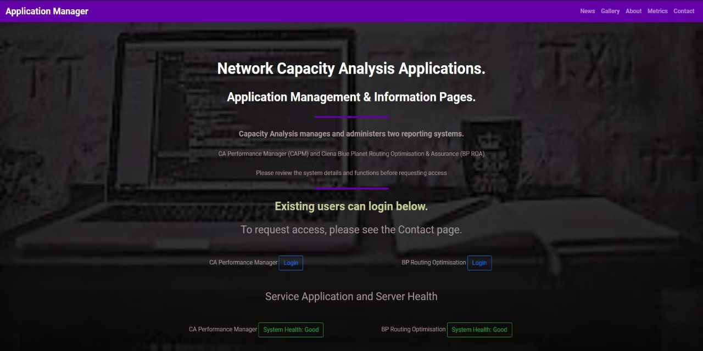

 **Application Manager**
 
 ________________________________________________________
 
A Code Institute Project in Centric Front End Website Development

***Author :*** Michael O'Farrell

***Website Summary :*** 

The website contains pages for 2 reporting systems used by my employers and the
employees. The aim of the site is to provide information, updates, access and examples of the systems and their use in 
daily business.

The colours, fonts and basic layouts are in keeping with the structure employed by the company with additional
styles and formats utilised to provide the institute with examples of my knowledge and abilities.

 
**To access a working demo please click **

________________________________________________________

**UX**

The website form,design and information was based on existing demands and requirements submitted to the team by staff which
is currently managed using email and phone.

The design goal was to provide a simple and central area for users to access all the required and relevant information
for the systems.

The design plan was to automate the existing process while making it simple and intuitive to follow. Each section or page
is designed to allow progression through the information before enabling access or requests.

The UX was finalised using user feedback and input.

 ________________________________________________________
 
 **Testing**

Testing was completed in 2 phases

*User Testing*

 _________________________

All pages functions and information was reviewed with a selection of users in the company with feedback being 
applied to the final release. All links are connected to the live sites and social media platforms to give a
better user experience.

All links to images, PDFs & URLs will open in a new tab to maintain user experience and all links have been
fully tested to confirm destinations and functionality is working.

As the contact page is not currently linked to the systems or internal ticket system, the 'Submit' buttons have 
no current functionality except to notify the user to enter the correct information in the forms. The 'Required' attribute 
has been applied to all fields bar the radio buttons.

*Browser Testing*

 _________________________

The site was tested on multiple browsers

* Google Chrome,
* MS Internet Explorer,
* MS Edge,
* Mozilla Firefox,
* Safari (Note: the testing on Safari was more limited than the testing on alternative browsers
due to the unavailabilty and non-use of Apple devices within the company).

The site was also tested on different devices.

* Desktop,
* Laptop,
* Android Tablet (10 inch),
* Samsung Galaxy S7 & S10+,
* iPhone & Ipad (Note the testing on Apple products was more limited than the testing on alternative
devices due to the unavailabilty and non-use of Apple devices within the company).

 ________________________________________________________

**Page Notes**

*General:* The Navbar is dynamic depending on which page the user is in and what type of device is in use. This is
to limit the quantity of irrelevant menu items on a page and also to give the user a simple notification of location
in the website. 

The footer contains the Legal Disclaimer and Privacy Policy in a modal to limit the space used and also to improve
user experience when navigating the site.

***Index:***

The index page contains the welcome detail, a login jump point for existing users and the status of the systems. It is planned
to connect these functions using JaveScript and Python in the future.

There are also a latest news and gallery sections that can be accessed from the menu and by scrolling. These
sections provide the user with updates on features, faults and releases and the gallery provides images of screen
types for the users to visualise the system outputs.

***About:***

The about page contains relevant information about the systems and also provides links to vendor pages, social media
and any document support pages.

***Metrics:***

The Metrics page provides users with details and information on both the out-of-the-box dashboards and the custom reports
available in the systems along with PDF examples accessible from dropdown menus.

NOTE: As there is currently no direct access to the systems from the website, the report examples are limnited to 
those that can be exported. The future release will enable users to view the systems in demo mode and see the 
greater level of reporting available.

***Contact***

The Contacts page contains 2 request forms.

The 1st form enables the user to request access to both/either systems and requires justification to be submitted
with the request. This is due to the limited number of user licences available.

The 2nd form give the opportunity for users to request additional information or add feature requirements. The 
future plan is to link this form with our ticket system and apply standard Service Level Agreements to the requests.

The security validation to prevent un-matched email addresses in the 'Access Request Form' is currently disabled until
full validation is developed for the next version update release.

 ________________________________________________________

**Employed Technologies**

- HTML
- CSS
- Bootstrap 
- Fontawesome 
- Google Font
- JQuery

 ________________________________________________________

**Additional Features**

Smooth-Scroll feature added to the index.html using JQuery

 ________________________________________________________

**Planned Future Releases or Updates**

I hope to add Javascript and Python functionality to automate the current updates
API queries are planned to both reporting systems

 ________________________________________________________

**Website Deployment**

This site is hosted on GitHub and deployed directly from the master branch. Any updates or new releases will be deployed to that master branch.

To run locally, you can clone this repository directly into the editor of your choice by pasting git clone https://github.com/Mofarrell1967/Application-Manager into your terminal. 
To unlink the site from the GitHub repository, type git remote rm origin into the terminal.

The site is hosted on GitHub and can be run from there or locally by pasting the following link directly into your browser. https://mofarrell1967.github.io/Application-Manager/

To view the source code please click on the following GitHub address  https://github.com/Mofarrell1967/Application-Manager

Future deployment will see the page hosted on the company intranet.
 ________________________________________________________

**Permissions & Acknowledgements**

CA Technologies, BT Ireland & Ciena Blue Planet for permission to use their images, documentation and links
CFernandini for source information on the smooth-scroll feature.
Code Institute for source code used in this project and called out in CSS.

 ________________________________________________________

**Images & Examples**

The carousel images and PDF examples courtesy of CA Technologies and Ciena Blue Planet.
The Jumbotron Image sourced from pxhere.com and edited to suit by applying filters, lighting and effects.

 ________________________________________________________

**Please Note that this site is currently for educational purposes only**

